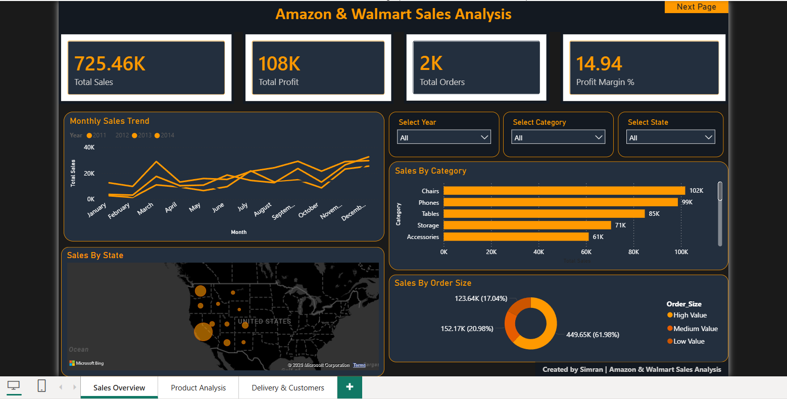
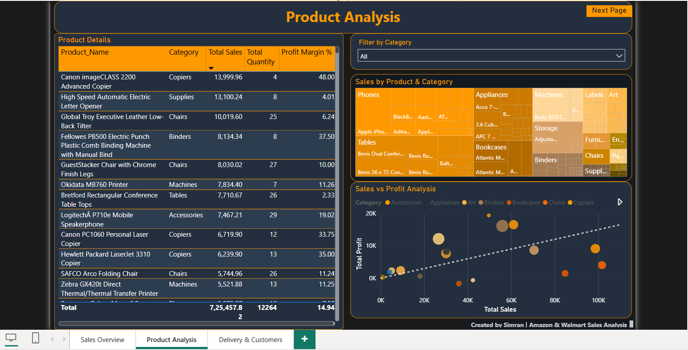
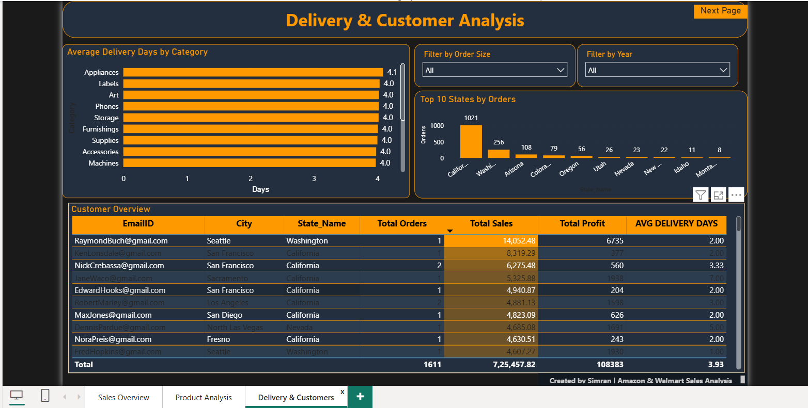

# Amazon & Walmart Sales Analysis
### End-to-End Data Analytics Project | Excel · SQL · Power BI


---

## What Is This Project About?

Retail businesses generate thousands of orders every day but 
often struggle to answer basic questions like — which products 
are actually profitable? Which states drive the most revenue? 
Are delivery timelines consistent?

This project takes raw Amazon and Walmart sales data and 
answers these questions through a complete data analysis workflow — 
from messy raw data to a clean interactive dashboard.

---

## The Data

| Detail | Info |
|--------|------|
| Total Records | 3,203 rows |
| Total Columns | 17 |
| Time Period | 2011 — 2014 |
| Data Source | Amazon & Walmart Sales Records |

---

## Tools Used & Why

| Tool | Purpose |
|------|---------|
| Microsoft Excel | Raw data cleaning, derived columns, pivot analysis |
| SQL Server (SSMS) | Deep-dive queries, aggregations, ranking, window functions |
| Power BI Desktop | 3-page interactive dashboard with DAX measures |

---

## What I Actually Did — Step by Step

### Stage 1 — Excel (Data Cleaning & Exploration)
- Removed duplicate records based on Order_ID
- Fixed inconsistent date formats across Order_Date and Ship_Date
- Created 5 new columns: Delivery_Days, Profit_Margin, 
  Order_Size, Year_col, Month_col
- Built 4 pivot tables to explore sales by category, 
  monthly trends, state performance and top products

### Stage 2 — SQL in SSMS (Data Analysis)
- Wrote queries to find total sales and profit by category
- Used RANK() window function to identify top 10 products by revenue
- Calculated average delivery days per region
- Found year-over-year sales growth using LAG() function
- Segmented customers by order value

### Stage 3 — Power BI (Dashboard Building)
- Created 8 DAX measures including Profit Margin %, 
  Total Orders, YoY Growth and Avg Delivery Days
- Built 3-page interactive dashboard with Amazon dark theme
- Added slicers, cross-filtering and page navigation
- Applied conditional formatting on customer table

---

## Key Business Insights Found

> These are real findings from the data — not made up examples.

- **California dominates** — 1,021 orders, which is 63% of all orders
- **Chairs are the top revenue category** — $1,02,000 in total sales
- **High Value orders dominate at 61.98%** — 449.65K out of 
  725.46K total sales comes from high value orders, showing 
  that customers tend to place large purchases
- **Delivery is consistent** — average 4 days across all categories, 
  showing a reliable logistics process
- **Profit Margin is 14.94%** — healthy overall but category-level 
  analysis shows Chairs have a margin of only 3.95% despite being 
  the top revenue category — showing high sales don't always mean high profit

---

## Dashboard Preview

### Page 1 — Sales Overview


### Page 2 — Product Analysis


### Page 3 — Delivery & Customer Analysis

---

## Repository Structure

```
Amazon-Walmart-Sales-Analysis/
│
├── Excel_Analysis/
│   ├── Amazon_Walmart_Cleaned_Data.xlsx
│   └── Excel_Analysis.md
│
├── PowerBI_Dashboard/
│   ├── Amazon_Walmart_Sales_Dashboard.pbit
│   ├── Page1_Sales_Overview.png
│   ├── Page2_Product_Analysis.png
│   └── Page3_Delivery_Customers.png
│
├── SQL_Analysis/
│
└── README.md
```

## DAX Measures Written in Power BI

- Total Sales = SUM('WORKING DATA'[Sales])
- Total Profit = SUM('WORKING DATA'[Profit])
- Total Orders = DISTINCTCOUNT('WORKING DATA'[Order_ID])
- Profit Margin % = DIVIDE([Total Profit],[Total Sales],0) * 100
- Avg Delivery Days = AVERAGE('WORKING DATA'[Delivery_Days])

## What I Learned From This Project

- How to clean and structure messy real-world data before analysis
- How SQL window functions like RANK() and LAG() make 
  analysis much more efficient than basic GROUP BY queries
- How DAX measures in Power BI respond dynamically to 
  filters — unlike calculated columns which are static
- How to design a dashboard that tells a story rather 
  than just showing numbers

---
##  About Me

**Simran Singh** | Aspiring Data Analyst
- Skills: Excel · SQL · Power BI
- Looking for: Entry-level Data Analyst roles

- LinkedIn: www.linkedin.com/in/simran-kumari-singh-029n02y
- Gmail: umanshi29@gmail.com
